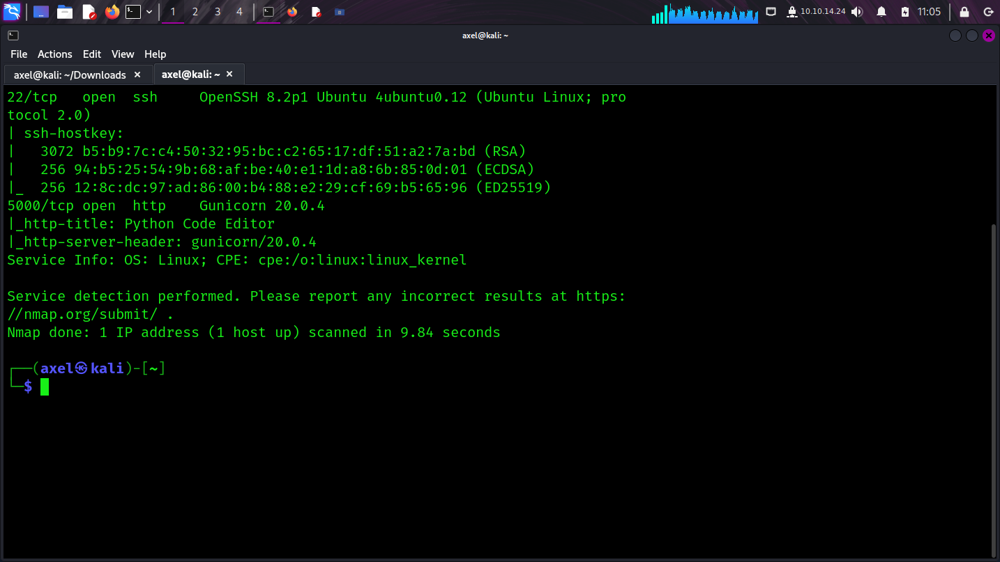
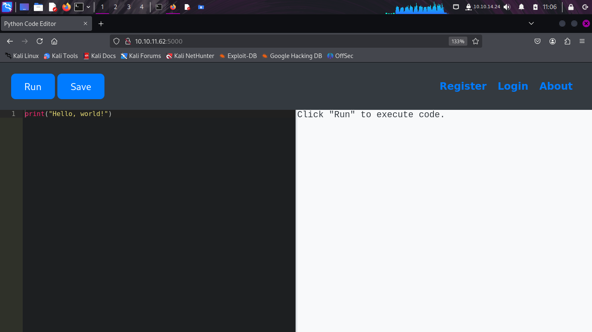
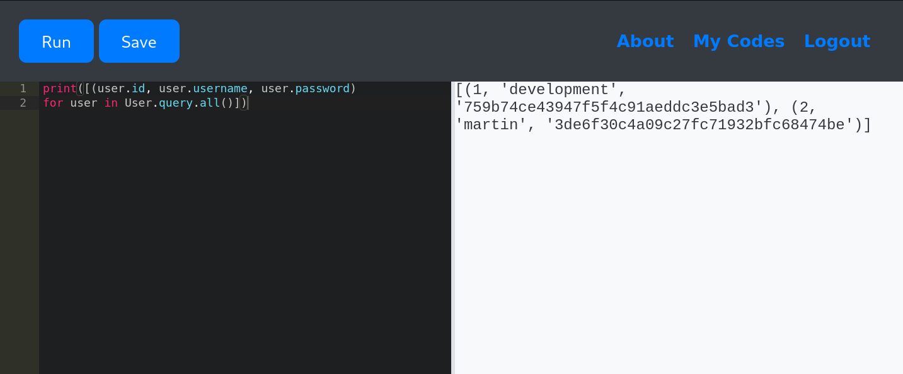
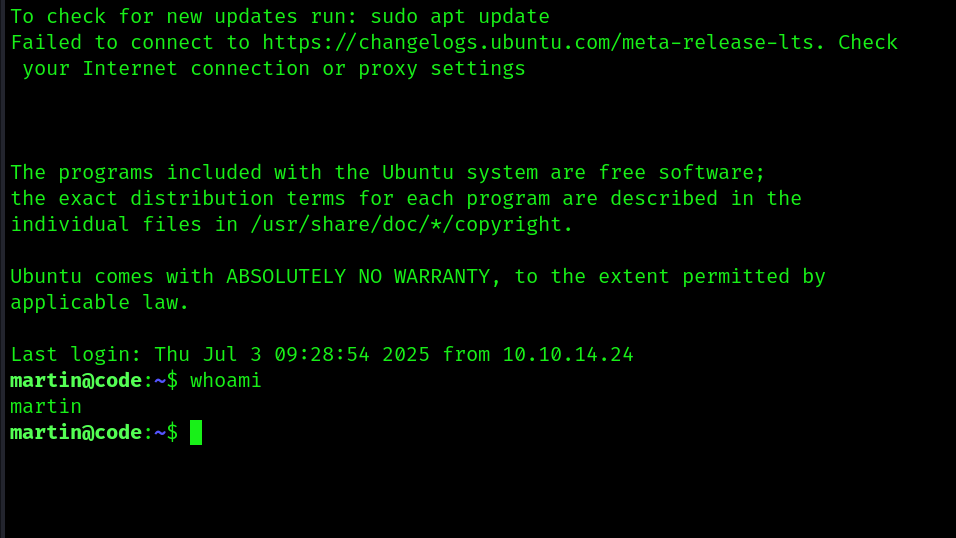
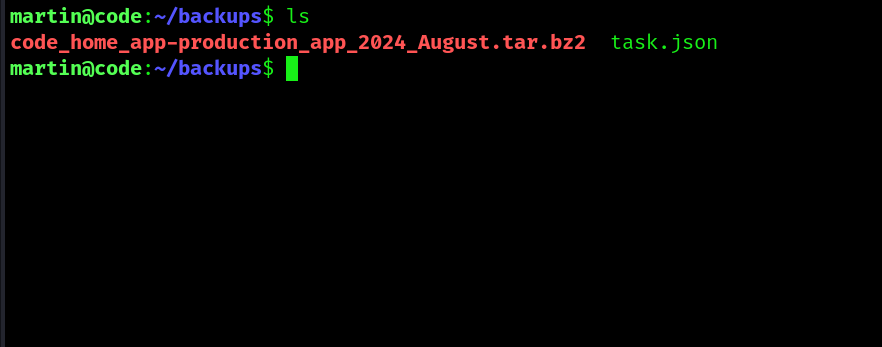
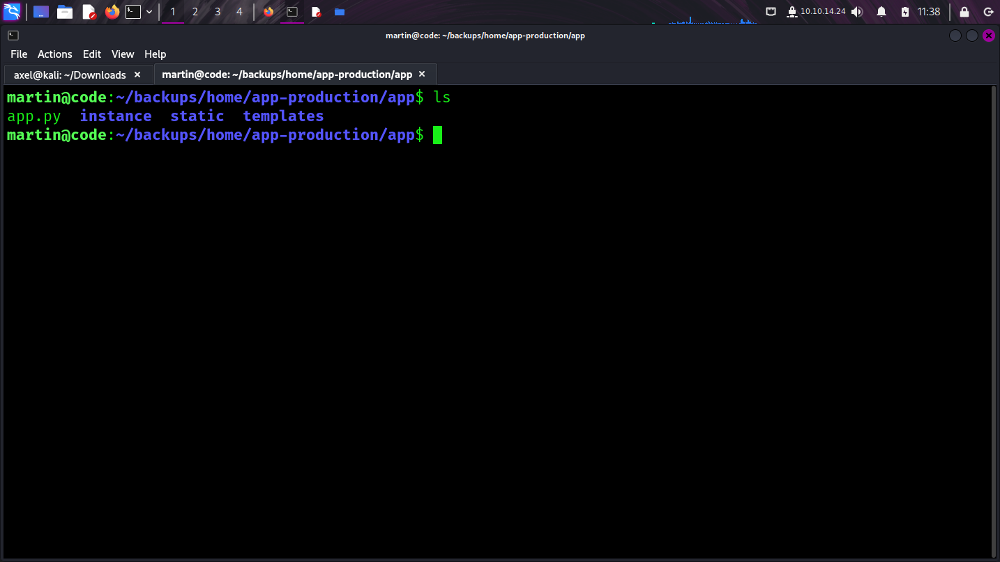
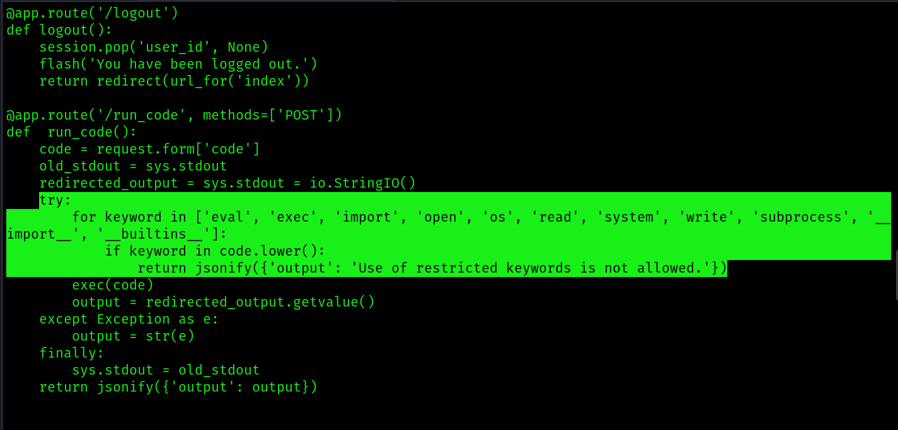
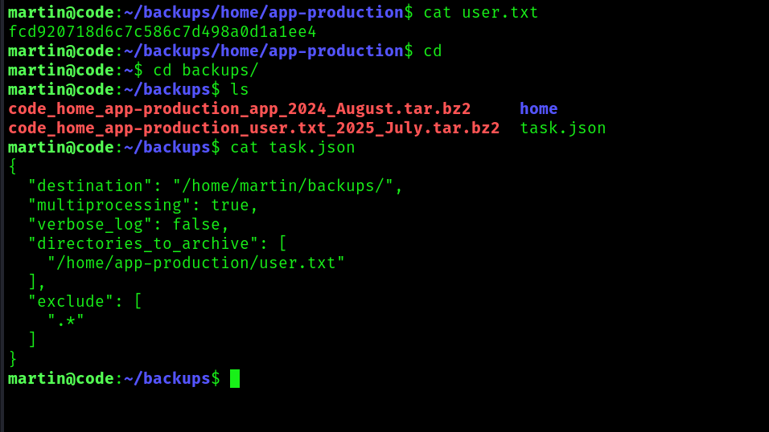
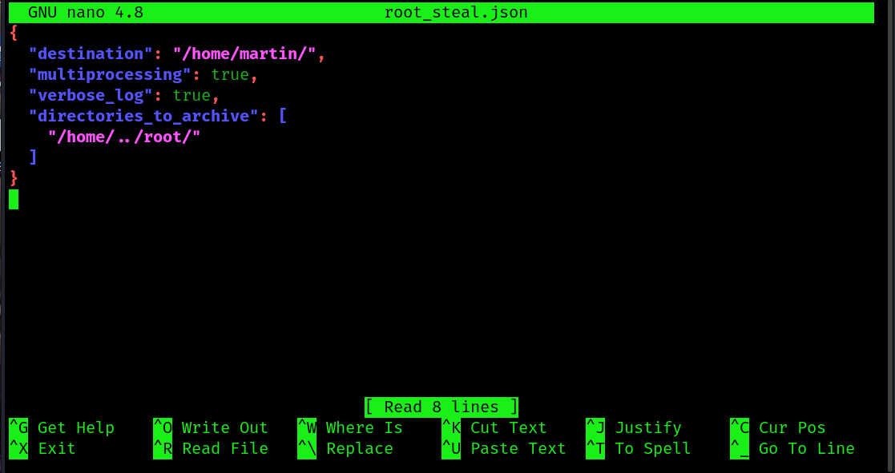

<h1>Code Writeup</h1>

<h3>Introduction</h3>
Code is an Easy-rated box on HackTheBox, in which a code injection vulnerability is used to gain low-privileged access to the server. 
A path traversal vulnerability is then exploited to obtain the root flag.

The purpose of this document is to show my approach to obtaining unauthorised root privileges on the server and how to remediate the discovered security issues.

<h3>Enumeration</h3>
Initial Nmap scan revealed SSH on port 22 and Gunicorn on 5000.

Subsequent Nmap scans did not reveal anything more. A brief web search revealed that Gunicorn is a web server written in Python, so the next step was to navigate to port 5000 in Firefox and investigate. This revealed an online Python code editor.

After creating an account and saving a simple python script, the script could be accessed by navigating to "My codes". Interestingly, the saved script had an ID of 2, which was shown in the URL. Path traversal using the ID was unsuccessful however.

<h3>Initial Access</h3>
The site's input validation was tested, since this presented an obvious attack path. Many Python functions that could be malicious were blocked. After some testing, the usernames and passwords of the logged-in users on the server were disclosed by the editor. The credentials were revealed by querying the SQLAlchemy library using a simple for-loop.

The passwords were hashed so I used hashcat to crack them. The revealed passwords were very weak, exposing another severe security flaw in the server. Using these credentials, access was granted to Martin's account using SSH. The "development" account did not have permission to connect via SSH.

No user flag was found in Martin's home directory. The only folder was a backups folder containing a json file and tar file.

Unzipping the tar file revealed a backup of the entire website. The json file contained a task to archive the website in martin's home directory.

Browsing the website's source code revealed a blacklist used to filter out malicious commands. This is generally not recommended because developers might forget to include lesser-known malicious commands in the blacklist.

After some further investigation, I discovered that Martin could run the script "backy.sh" with superuser privileges. Backy is a script used for creating backups of directories. By this point I suspected that this script could be used to retrieve the user flag, because there was none in Martin's directory and I did not have permission to enter the "app-production" directory on the server, which was the only interesting directory.

The user flag was retrieved by modifying the task.json file and creating a backup using backy.sh. The backup was created as a tar file and the flag was retrieved after unpacking the tar file.

<h3>Privilege Escalation to Root</h3>
An attempt was made to retrieve the root flag from /root using backy, this was unsuccessful as backy would only backup directories under /var/ and /home/.

After some testing, the root folder was saved to /home/ by injecting a path traversal command to the destination in the task.json file.

Once the root folder was saved, the root flag was extracted from the root.txt file.

<h3>Remediation steps and conclusion</h3>
