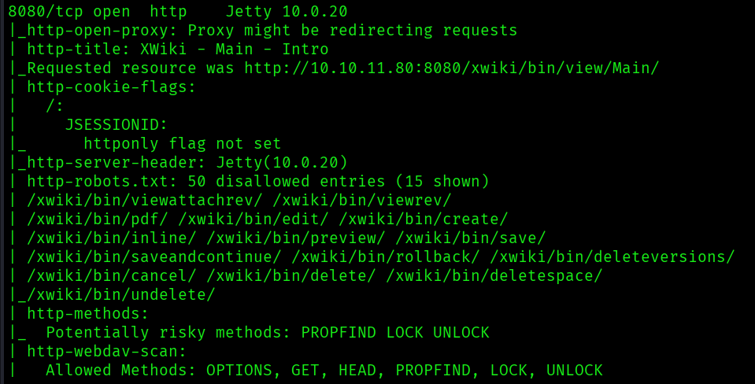
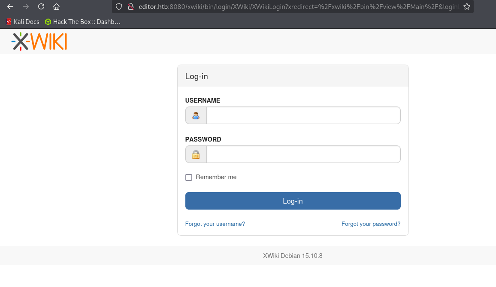
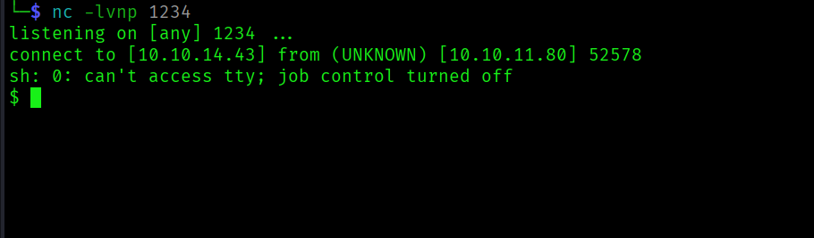
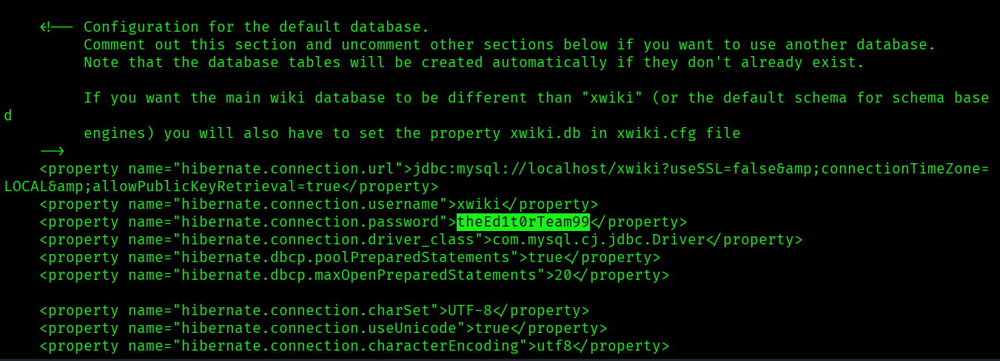
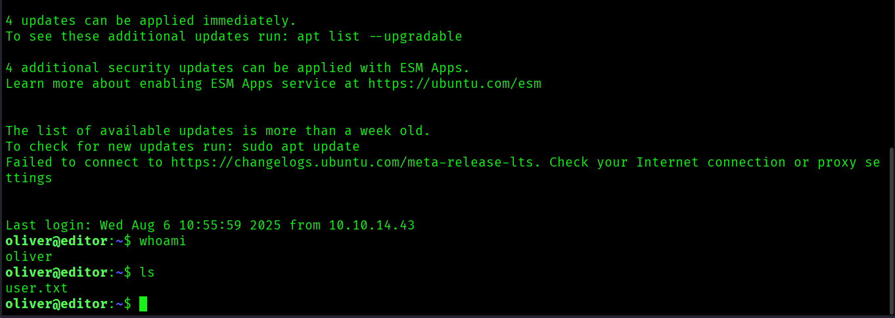
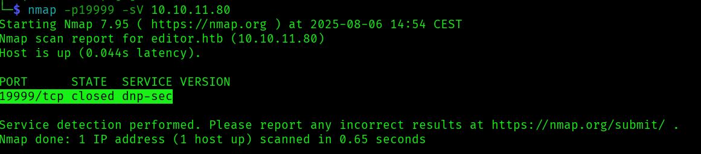
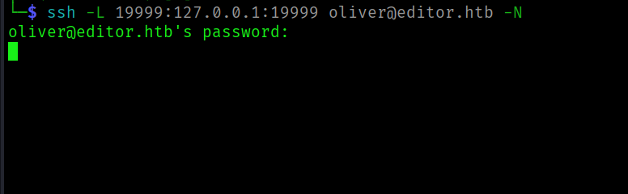
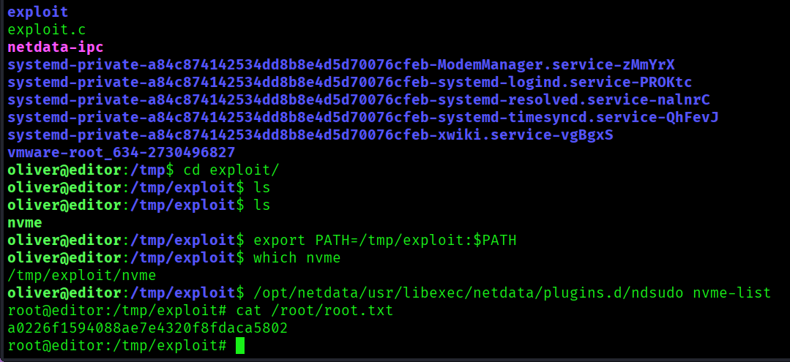

<h1> Editor Writeup </h1>

<h3> Introduction </h3>
Editor is an Easy-rated box on HackTheBox, consisting of a web page, a wiki and a NetData instance. The purpose of this document is to show how I obtained unauthorized root privileges on the box.

<h3> Enumeration </h3>
As always I started with an Nmap scan of the provided IP address, the scan showed the following open ports and services:

- SSH on port 22
- HTTP on port 80
- Jetty on port 8080

Both the services on 80 and 8080 looked interesting because these ports almost always contain a webpage that can be used as an entry point.
There were no other open ports of interest so I decided the investigate the web servers (HTTP and Jetty).

A website for a code editor was hosted on port 80, but I could not find anything of interest there, except for a link to the code editor's documentation.
I suspected that the documentation was hosted on port 8080, since Nmap showed that XWiki was hosted on the Jetty server on that port.

Navigating to port 8080 in Firefox revealed the login page for XWiki.

The first crucial hint was revealed on this page, namely the version of the XWiki instance: 15.10.8. The first thing I look for when I come across
a page running any type of software is the version. Knowing the version helps me to find vulnerabilities that could be used to either obtain an initial
access or increase my privileges.

<h3> Initial Access </h3>
I did a quick online search and found that XWiki 15.10.8 is vulnerable to CVE-2025-24893, a remote code execution vulnerability that allows
an unauthenticated guest to execute arbitrary code through a request to the endpoint “SolrSearch”.

A PoC was found at https://github.com/dollarboysushil/CVE-2025-24893-XWiki-Unauthenticated-RCE-Exploit-POC. The PoC was used to gain reverse shell access to the server.

The objective now was to increase my privileges to user level, since I had access as the "xwiki" account which did not have many privileges.
I discovered that MySQL was installed on the server, however the user “xwiki” did not have permissions to run it. I ran "cat /etc/passwd" to see
which users were available, if any, so I knew which user to focus on. I discovered a user named "oliver" and searched around the filesystem for his password.

A password was found in “hibernate.cfg.xml” in /etc/xwiki, this password was used to SSH into the server as Oliver.

The user flag was found in Oliver's home directory.

<h3> Privilege Escalation to Root </h3>
I decided to check if there were any other ports open, since I did not find any other interesting files on the filesystem.
I ran "netstat -tulpn" which revealed that port 3306 again, Oliver however did not have the right to use MySQL so I discarded the idea of trying to access the database.
Another open port was 19999, a quick nmap scan combined with online search showed that DNP-Secure was likely using that port. DNP3 stands for “Distributed Network Protocol” and is a set of communications protocols used between components in process automation systems.

I decided to investigate what was running on that port and to do that I forwarded port 19999 to my local VM using SSH.

Upon accessing the port via Firefox a NetData dashboard appeared.
NetData is a monitoring system for servers, IoT devices etc. There was an alert stating that the node “editor” was running version 1.45.2
and needed an urgent update. As mentioned previously version numbers are an invaluable clue during these challenges and in this case I was lucky enough
that the dashboard explicity required an urgent update. This was a clear indication that the dashboard likely had a very interesting vulnerability.

Online search revealed CVE-2024-32019, a local privilege escalation vulnerability that allows an attacker to run arbitrary programs with root permissions using the “ndsudo" tool that comes with NetData.
The "ndsudo" tool is packaged as a "root"-owned executable with the SUID bit set. The search paths to the commands that "ndsudo" can run are defined by the PATH variable, which can be modified by a user.

A PoC for this vulnerability was found at https://github.com/dollarboysushil/CVE-2024-32019-Netdata-ndsudo-PATH-Vulnerability-Privilege-Escalation.
It involves injecting a malicious binary into the current user's PATH that impersonates a trusted command. The binary is then executed with root privileges by “ndsudo”.
In this case the binary could be used to start a shell instance as the "root" user. The instructions were followed and I started a shell as root.

The root flag was then obtained and the box was completed!

<h3> Remediation steps and conclusion </h3>
This box highlights the importance of keeping software up to date. Vulnerabilities can occur anywhere in the infrastructure and
attackers will take advantage of every entry point they can find, no matter how far-fetched it may seem. 

The vulnerabilities present in this box were severe as they both allowed an unauthorized user to execute commands, highlighting the importance of sanitizing user input in XWiki's case
and also ensuring that special privileges for programs cannot be abused in NetData's case. Another effective remediation would be to improve the network segmentation.
I was able to forward the port that was hosting NetData and access it as Oliver. This might not be desirable in all situations, so a good idea would be
to run NetData on a separate, local network (or via a VPN) to restrict unauthorized access.

It is always best practice to keep installed software up to date, regardless of how the network is segmented or which permissions are set to the programs in use.
