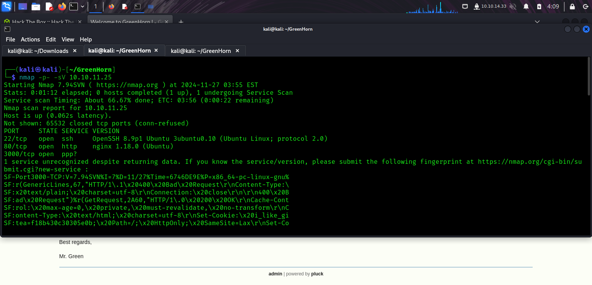
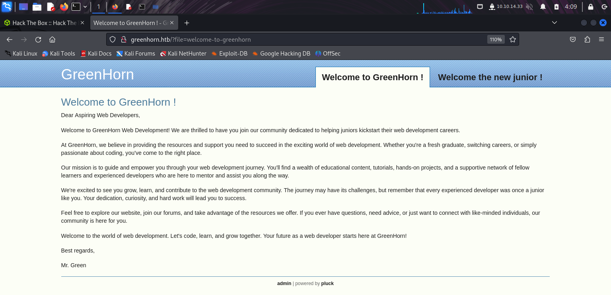
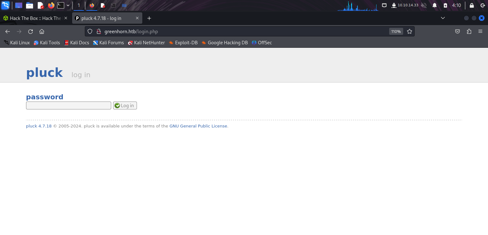
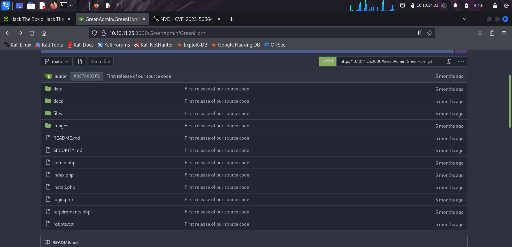
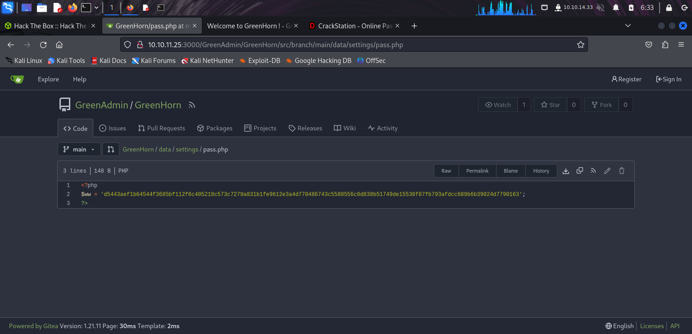
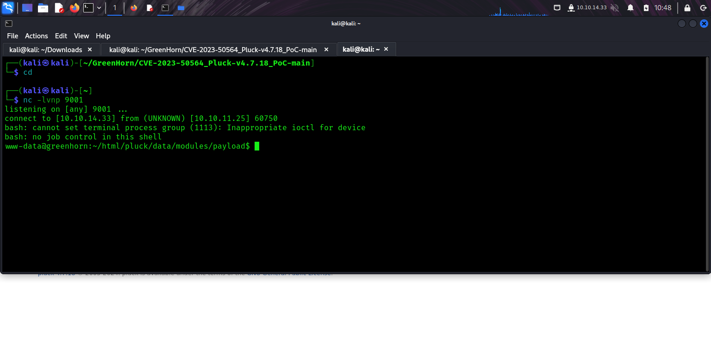
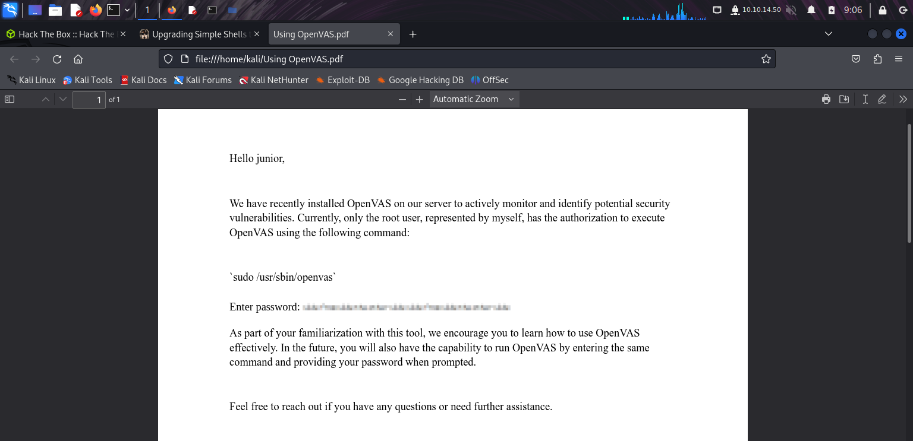

<h1> GreenHorn Writeup </h1>

<h3> Introduction </h3>
GreenHorn is an Easy-rated box on HackTheBox which focuses on a file upload vulnerability as its main entry point. The purpose of this document is to show my approach to obtaining unauthorised root privileges on the server and how to remediate the discovered security issues.

<h3> Enumeration </h3>
Initial Nmap scan with -p- and -sV showed ssh running on port 22, http on 80 and "ppp?" on 3000, aswell as 1 unrecognized service. Scan on port 3000 with sudo showed nothing new, service is listed as "ppp?". Internet search reveals that various services run on port 3000, such as user-level ppp daemon and various other software. 

This simple scan showed me some very important details about this box:
- A website is running on the server, which is very likely an entry point if it for example has file upload functionality.
- SSH could be used as an entry point if there is nothing useful on the website.

With this in mind I decided to investigate the website. Navigating to the adress on port 80 redirects to greenhorn.htb, I added the domain to /etc/hosts for convenience. Connecting to the domain reveals a website providing learning resources for aspiring web developers. Note that the requested file is shown in the adress bar. This could be used for command execution however I was not able to execute any commands. I also discovered that the backend used is pluck 4.7.18 and that on the bottom of the page is a link to login as an administrator. This information will be helpful to gain initial access.

<h3> Initial access </h3>
Now that I know the name and version of the backend the next step is to check if there are any known vulnerabilities that I can use. Searching for "pluck 4.7.18 vulnerabilities" leads to CVE-2023-50564, an arbitrary file upload vulnerability that allows attackers to execute code by uploading a zip-file. There is however no file upload functionality that I can access right now, so the next step is to figure out how to login as a site admin. 

There is nothing more of interest on port 80, and I do not have any credentials I can use to connect via SSH. Nmap could not determine for certain what service was running on port 3000, so the next step is to explore what is running on that port. Navigating to port 3000 reveals a Git service. It contains a repository called GreenHorn created by GreenAdmin.
This contains the source code for the entire website.

A hashed string was found in data/settings/pass.php. The name implies that it is a hashed password so I go to crackstation.net and enter the string. Crackstation gives the output "iloveyou1" hashed with sha512 and I use it to successfully login as site admin. 

The aforementioned vulnerability is due to a flaw in pluck's module uploading function, which is exploited by uploading a malicious zip-file as a module.

Uploaded modules are usually accessed at /data/modules, however I get an error 403 Forbidden when attempting to access that subdomain, even when logged in. After some searching I found a GitHub repository with a PoC script that automatically uploads the zip as a module and accesses its contents (credit to Rai2en: https://github.com/Rai2en/CVE-2023-50564_Pluck-v4.7.18_PoC/tree/main). After executing the script access as www-data was established.

Usually, this user has permission to read the user.txt file but not in this box. Navigating to /home/ shows a user named junior, thus the objective now is to get access to junior's account.
This was straightforward, the same password used to log in to the admin panel ("iloveyou1") works to log in as junior. Once logged in as junior I was allowed to read the user.txt file and retrieve the user flag.

<h3> Privilege Escalation to Root </h3>

The next objective is to gain root access on the server. 
There is a PDF called "Using OpenVAS" in junior's directory, OpenVAS is an open-source vulnerability scanner. If OpenVAS is installed on the server I can use that instead of uploading linPEAS to find vulnerabilities and increase my privileges.

I started an http server and downloaded the PDF file to my VM using wget. The PDF contains a message informing junior about OpenVAS being installed on the server. Only the root user can start OpenVAS, using sudo -l shows that junior does not have any root privileges at all. This means that I need to elevate my privileges somehow to start OpenVAS. The PDF mentions that OpenVAS is located at /usr/sbin/openvas, however OpenVAS could not be found in that directory. Furthermore, the command "openvas" is not recognized, so OpenVAS is probably not installed on the server and is therefore not useful to escalate my privileges.

There is nothing else of interest that junior can access, and running linPEAS several times does not return any interesting results. The only lead that I have is the "Using OpenVAS" pdf.
The PDF contains a blurred-out password, probably for the root account. It is worth a shot to try and somehow deobfuscate this password. Searching around leads me to a GitHub repository for a program called Depix (https://github.com/spipm/Depixelization_poc). The program takes the pixelized image and an image of a character sequence as input, and uses advanced pattern matching to return a depixelized image. I used an online tool to extract the image of the pixelized password from the pdf file. Running Depix using the extracted image as an argument reveals a partially depixelated image, which is enough for me. I change to the root user by typing "su", enter the password shown in the depixelated image and gain access to the root account. From there I simply read the root.txt file and complete the box!

<h3> Remediation steps and conclusion </h3>
Open-source software is highly relevant and will probably continue to be so for the foreseeable future. However, when source code is made available to everyone it is very important to ensure that no sensitive information is included. In this case a password was left in the code repository, which shows that Junior is lacking critical security awareness. It is bad practice to store credentials in source code, no matter if it is closed or open source. The password itself, iloveyou1, is also very insecure since it is nowadays trivial for tools like Hashcat or websites like Crackstation to crack the hash and reveal the password. Junior should have chosen a longer password and stored it in a more secure location instead of the project's source code. 
   

Junior is not the only one on the team with inadequate security awareness however. Admin included his/her password, albeit obfuscated, in the PDF sent to Junior for no reason. And as I discovered it was easy to depixelate the string and reveal the password. Passwords and other credentials should never be stored in plain text or obfuscated in ways other than hashing or encrypting, these methods are proven to be safe whereas for example pixelation are less secure than they appear.

Aside from inadequate security awareness, the other vulnerability present in this box was the file upload vulnerability in pluck 4.7.18. Fortunately this vulnerability is publicly disclosed and has been fixed by the developers of pluck, so the remediation is to simply update pluck to the newest version. It is important for developers and system administrators to continously monitor external dependencies of a software project (such as plugins, APIs, other programs etc) for security updates and apply them as soon as possible. 

Most of the heavy lifting was done by the proof of concept script which automatically sends a malicious zip file as a module and acceses it. The payload contained in the zip-file is executed and connects to a netcat listener on my VM. I first attempted to exploit this vulnerability manually, by accessing the subdomain which contains the uploaded modules through my web browser, but as previously mentioned I got a 403 Forbidden error and could not access that part of the site.
I realize in retrospect that I could have tried to access that page through Burp Suite.  

Nevertheless I felt like I learned a lot from this box, it was challenging but not overwhelming. And I felt a great sense of achievement once I got the root flag!
